# Funding Application Submission & Assessment Platform

A comprehensive, enterprise-grade platform for managing funding calls, applications, assessments, and results. Built with modern architecture, decentralized identity, AI-powered features, and high-performance WASM visualizations.

[](https://opensource.org/licenses/MIT)
[](https://www.typescriptlang.org/)
[](https://reactjs.org/)
[](https://nodejs.org/)
[](https://www.postgresql.org/)

> **[Live Demo](https://dreamlab-ai.github.io/funding-platform/)** -- Browse the frontend SPA deployed on GitHub Pages.

## Overview

This platform provides a complete solution for organizations managing competitive funding programs, research grants, or any application-based selection process. It supports the entire lifecycle from call creation through application submission, expert assessment, and final results aggregation.

### Key Features

- **Multi-Call Management** - Create and manage multiple funding calls with customizable criteria
- **Applicant Portal** - Intuitive interface for application submission with file uploads
- **Assessor Interface** - Streamlined assessment workflow with CoI declarations
- **Coordinator Dashboard** - Full oversight with assignment management and progress tracking
- **Master Results** - Aggregated scoring with variance detection and analytics
- **Decentralized Identity** - Nostr-based DID authentication (NIP-05, NIP-07, NIP-98)
- **Model-Agnostic AI** - Configurable AI assistance (OpenAI, Anthropic, Ollama, LM Studio)
- **WASM Visualizations** - High-performance Rust/WebAssembly charts and graphs
- **GDPR Compliant** - Full audit logging, data export, and privacy controls
- **WCAG 2.1 AA** - Accessibility-first design system

## Screenshots

<details>
<summary><strong>📸 Click to expand screenshots</strong></summary>

### Applicant Views

<table>
<tr>
<td width="50%">

**Open Funding Calls**

Browse available funding opportunities with deadline badges and application counts.


</td>
<td width="50%">

**Coordinator Dashboard**

Full management dashboard with sidebar navigation and pending item badges.


</td>
</tr>
</table>

### Admin & Authentication

<table>
<tr>
<td width="50%">

**AI Settings Panel**

Model-agnostic AI configuration with provider selection and feature toggles.


</td>
<td width="50%">

**Auth Layout**

Clean authentication interface supporting both JWT and Nostr DID login methods.


</td>
</tr>
</table>

</details>

---

## Architecture


## Technology Stack

### Frontend
- **React 18** with TypeScript
- **Vite** for fast development and builds
- **TanStack Query** (React Query) for data fetching and caching
- **React Router** for navigation
- **Tailwind CSS** + **Headless UI** for styling and accessible components
- **React Hook Form** + **Zod** for form validation
- **WASM/Rust** visualizations using `plotters-canvas`

### Backend
- **Node.js 20+** with Express
- **TypeScript** with strict mode
- **PostgreSQL 15** with UUID primary keys
- **Redis** for session management and caching
- **JWT** + **Nostr** authentication (NIP-07 browser extension, NIP-05 verification, DID:nostr identity)
- **Zod** for API validation
- **Winston** for structured logging

### AI Integration
- **OpenAI** (GPT-4, GPT-3.5)
- **Anthropic** (Claude)
- **Ollama** (local models)
- **LM Studio** (local inference)
- **Custom endpoints** (configurable)

### Infrastructure & Deployment
- **GitHub Pages** for frontend SPA deployment (auto-deploy on push to main)
- **Kubernetes** for backend services (manual workflow_dispatch deployment)
- **Docker** + **Docker Compose** for local development
- **GitHub Actions** CI/CD (CI Pipeline, Security Scan, Pages Deploy, K8s Deploy)
- **Vite** base path auto-configured for GitHub Pages subpath
- **Prometheus** + **Grafana** monitoring

## Quick Start

### Prerequisites

- Node.js 20+
- PostgreSQL 15+
- Redis 7+
- Docker & Docker Compose (optional)

### Development Setup

```bash
# Clone the repository
git clone https://github.com/dreamlab-ai/funding-platform.git
cd funding-platform

# Copy environment variables
cp .env.example .env
# Edit .env with your configuration

# Install dependencies
cd backend && npm install
cd ../frontend && npm install

# Run database migrations
cd ../database
psql -U postgres -d funding_platform -f migrations/001_initial_schema.sql
psql -U postgres -d funding_platform -f migrations/002_indexes.sql
psql -U postgres -d funding_platform -f migrations/003_user_identities.sql

# Start development servers
cd ../backend && npm run dev
cd ../frontend && npm run dev
```

### Docker Development

```bash
# Start all services
docker-compose up -d

# View logs
docker-compose logs -f

# Stop services
docker-compose down
```

## Project Structure

```
funding-platform/
├── backend/                    # Node.js Express API
│   └── src/
│       ├── ai/                # Model-agnostic AI integration
│       │   ├── providers/     # OpenAI, Anthropic, Ollama, LM Studio
│       │   └── features/      # Summarize, scoring-assist, anomaly, similarity
│       ├── auth/              # Nostr DID authentication
│       ├── config/            # Configuration management
│       ├── controllers/       # Route handlers
│       ├── middleware/        # Auth, RBAC, validation, rate limiting
│       ├── models/            # Data models
│       ├── routes/            # API routes
│       ├── security/          # JWT, RBAC, audit, CSRF
│       ├── services/          # Business logic
│       ├── types/             # TypeScript definitions
│       └── utils/             # Helpers and utilities
├── frontend/                  # React TypeScript application
│   └── src/
│       ├── components/        # Reusable UI components
│       │   ├── ui/           # Design system components
│       │   └── Visualizations/ # WASM chart wrappers
│       ├── hooks/             # Custom React hooks
│       ├── lib/               # Utilities and services
│       │   └── nostr/        # Nostr DID client library
│       ├── pages/             # Page components
│       ├── services/          # API client services
│       ├── stores/            # State management
│       ├── styles/            # CSS and design tokens
│       └── wasm/              # WASM loader and bindings
├── wasm-viz/                  # Rust WASM visualization library
│   └── src/
│       ├── charts/           # Chart implementations
│       │   ├── score_distribution.rs
│       │   ├── progress_tracker.rs
│       │   ├── variance_heatmap.rs
│       │   ├── timeline.rs
│       │   └── network_graph.rs
│       └── lib.rs            # WASM entry point
├── database/                  # PostgreSQL schemas
│   ├── migrations/           # SQL migrations
│   └── seeds/                # Development data
├── infrastructure/           # Infrastructure as code
│   └── terraform/           # AWS/GCP/Azure configs
├── k8s/                      # Kubernetes manifests
├── docs/                     # Documentation
│   ├── api/                 # OpenAPI specifications
│   └── architecture/        # Architecture decision records
├── scripts/                  # Utility scripts
├── .github/                  # GitHub Actions workflows
└── docker-compose.yml        # Docker development setup
```

## User Roles

| Role | Permissions |
|------|-------------|
| **Applicant** | Submit applications, upload files, track status |
| **Assessor** | View assigned applications, submit assessments, declare CoI |
| **Coordinator** | Manage calls, assign assessors, view all applications, export results |
| **Scheme Owner** | View results, approve funding decisions |
| **Admin** | Full system access, user management, audit logs |

```mermaid
flowchart LR
    subgraph Roles["User Roles & Permissions"]
        Admin["🔑 Admin"]
        Coord["📋 Coordinator"]
        Owner["💰 Scheme Owner"]
        Assessor["📝 Assessor"]
        Applicant["👤 Applicant"]
    end

    subgraph Actions
        Users["Manage Users"]
        Calls["Manage Calls"]
        Assign["Assign Assessors"]
        Review["Review Results"]
        Assess["Submit Assessments"]
        Apply["Submit Applications"]
    end

    Admin --> Users & Calls & Assign & Review & Assess & Apply
    Coord --> Calls & Assign & Review
    Owner --> Review
    Assessor --> Assess
    Applicant --> Apply

    style Admin fill:#ff6b6b,stroke:#c92a2a
    style Coord fill:#4dabf7,stroke:#1864ab
    style Owner fill:#69db7c,stroke:#2b8a3e
    style Assessor fill:#ffd43b,stroke:#f59f00
    style Applicant fill:#e599f7,stroke:#9c36b5
```



## Application Lifecycle


## Authentication Flow


## Database Schema


## API Overview

### Authentication
```
POST /api/v1/auth/register          # Register new user
POST /api/v1/auth/login             # Login with email/password
POST /api/v1/auth/nostr/challenge   # Get Nostr challenge
POST /api/v1/auth/nostr/verify      # Verify Nostr signature
POST /api/v1/auth/refresh           # Refresh JWT token
```

### Funding Calls
```
GET  /api/v1/calls/open             # List open calls (public)
POST /api/v1/calls                  # Create new call
GET  /api/v1/calls/:id              # Get call details
PUT  /api/v1/calls/:id              # Update call
POST /api/v1/calls/:id/close        # Close call
```

### Applications
```
POST /api/v1/applications           # Create application
GET  /api/v1/applications/my        # My applications
PUT  /api/v1/applications/:id       # Update draft
POST /api/v1/applications/:id/submit # Submit application
POST /api/v1/applications/:id/files # Upload files
```

### Assessments
```
GET  /api/v1/assessments/my         # My assignments
POST /api/v1/assessments/assignment/:id    # Submit assessment
POST /api/v1/assessments/assignment/:id/submit  # Final submit
```

### Assignments
```
POST /api/v1/assignments            # Assign assessor
POST /api/v1/assignments/bulk       # Bulk assign
GET  /api/v1/assignments/progress/:callId  # Progress overview
```

### Results
```
GET  /api/v1/results/call/:id       # Master results
GET  /api/v1/results/call/:id/ranking    # Ranking
GET  /api/v1/results/call/:id/export     # Export CSV
GET  /api/v1/results/call/:id/analytics  # Analytics
```

### AI Features
```
POST /api/v1/ai/summarize           # Summarize application
POST /api/v1/ai/scoring-assist      # AI scoring suggestions
POST /api/v1/ai/anomaly             # Detect scoring anomalies
POST /api/v1/ai/similarity          # Find similar applications
```

## Nostr DID Authentication

The platform uses Nostr-based decentralized identity as its primary authentication mechanism. Users sign in via a **NIP-07 compatible browser extension** (e.g., Alby, nos2x), which provides cryptographic key management without passwords. Each user's identity is represented as a **DID:nostr** identifier derived from their public key, and optionally verified through **NIP-05** DNS-based verification (e.g., `user@example.com`).

The admin/coordinator user is **jjohare** (GitHub contributor and repository owner).

```typescript
// Generate or import Nostr keys
import { generateKeyPair, getPublicKey } from '@/lib/nostr';

// Create DID from public key
const did = `did:nostr:${publicKeyHex}`;

// Sign authentication challenge
const event = await signEvent({
  kind: 22242,
  content: challenge,
  tags: [['challenge', challengeId]]
});

// Verify with backend
await api.post('/auth/nostr/verify', { event });
```

Supported NIPs:
- **NIP-01**: Basic protocol flow
- **NIP-05**: DNS-based verification
- **NIP-07**: Browser extension signing
- **NIP-98**: HTTP Auth events

## WASM Visualizations

High-performance charts rendered with Rust and WebAssembly:

```rust
// Rust implementation (wasm-viz/src/charts/score_distribution.rs)
#[wasm_bindgen]
pub fn render_score_distribution(
    canvas_id: &str,
    scores: &[f64],
    options: JsValue
) -> Result<(), JsValue> {
    let backend = CanvasBackend::new(canvas_id)?;
    let root = backend.into_drawing_area();

    // Histogram with customizable bins
    let mut chart = ChartBuilder::on(&root)
        .caption("Score Distribution", ("sans-serif", 20))
        .build_cartesian_2d(range.clone(), 0u32..max_count)?;

    chart.draw_series(Histogram::vertical(&chart)
        .style(BLUE.filled())
        .data(scores.iter().map(|x| (*x, 1))))?;

    Ok(())
}
```

```tsx
// React wrapper
import { useWasmViz } from '@/wasm/hooks/useWasmViz';

function ScoreDistribution({ scores }) {
  const { ready, renderChart } = useWasmViz();
  const canvasRef = useRef<HTMLCanvasElement>(null);

  useEffect(() => {
    if (ready && canvasRef.current) {
      renderChart('score_distribution', canvasRef.current.id, scores);
    }
  }, [ready, scores]);

  return <canvas ref={canvasRef} id="score-dist" />;
}
```

Available visualizations:
- **Score Distribution** - Histogram with configurable bins
- **Progress Radial** - Circular progress indicators
- **Variance Heatmap** - Score variance visualization
- **Submission Timeline** - Time-series chart
- **Assignment Network** - Force-directed graph

## AI Provider Configuration

```mermaid
flowchart TB
    subgraph Client["Frontend Client"]
        UI[AI Features UI]
    end

    subgraph Backend["Backend API"]
        Router[AI Router]
        Cache[(Response Cache)]
    end

    subgraph Providers["AI Providers"]
        OpenAI[OpenAI<br/>GPT-4/3.5]
        Anthropic[Anthropic<br/>Claude]
        Ollama[Ollama<br/>Local Models]
        LMStudio[LM Studio<br/>Local Inference]
        Custom[Custom<br/>Any OpenAI-compatible]
    end

    subgraph Features["AI Features"]
        Summarize[📄 Summarize<br/>Application summaries]
        Scoring[📊 Scoring Assist<br/>AI suggestions]
        Anomaly[⚠️ Anomaly Detection<br/>Score variance]
        Similarity[🔗 Similarity<br/>Find duplicates]
    end

    UI --> Router
    Router --> Cache
    Cache -.->|Cache Hit| Router
    Router --> OpenAI & Anthropic & Ollama & LMStudio & Custom
    Router --> Features

    style OpenAI fill:#10a37f,stroke:#0d8a6f,color:#fff
    style Anthropic fill:#d4a574,stroke:#b8956a
    style Ollama fill:#1a1a1a,stroke:#333,color:#fff
    style LMStudio fill:#6366f1,stroke:#4f46e5,color:#fff
```



Configure AI providers in `.env`:

```bash
# OpenAI
AI_OPENAI_API_KEY=sk-...
AI_OPENAI_MODEL=gpt-4

# Anthropic
AI_ANTHROPIC_API_KEY=sk-ant-...
AI_ANTHROPIC_MODEL=claude-3-sonnet

# Ollama (local)
AI_OLLAMA_BASE_URL=http://localhost:11434
AI_OLLAMA_MODEL=llama2

# LM Studio (local)
AI_LMSTUDIO_BASE_URL=http://localhost:1234
AI_LMSTUDIO_MODEL=local-model

# Custom endpoint
AI_CUSTOM_BASE_URL=http://your-endpoint
AI_CUSTOM_MODEL=your-model
AI_CUSTOM_API_KEY=your-key

# Default provider
AI_DEFAULT_PROVIDER=openai
```

## Security Features

- **RBAC** - Role-based access control with fine-grained permissions
- **JWT** - Secure token-based authentication with refresh rotation
- **Nostr DID** - Decentralized identity verification
- **CSRF Protection** - Double-submit cookie pattern
- **Rate Limiting** - Request throttling per user/endpoint
- **Input Sanitization** - XSS prevention
- **Audit Logging** - Complete action trail
- **File Validation** - Type and size restrictions
- **Encrypted Storage** - Sensitive data encryption at rest

## GDPR Compliance

- **Consent Management** - Explicit consent tracking
- **Data Export** - User data export in machine-readable format
- **Right to Erasure** - Automated data deletion workflows
- **Audit Trail** - Complete history of data access and modifications
- **Data Minimization** - Collect only necessary information
- **Anonymization** - Support for anonymizing exported results

## Development

### Test Coverage: 1,672 Tests

<details>
<summary><strong>🧪 Click to view test breakdown</strong></summary>

| Category | Files | Tests | Coverage |
|----------|-------|-------|----------|
| **Unit - Security** | 6 | ~313 | RBAC, JWT, Nostr DID, Audit |
| **Unit - Services** | 4 | ~167 | Scoring, File, Email, Export |
| **Unit - Utils** | 6 | ~380 | Validation, Logger, Helpers |
| **Unit - AI** | 7 | ~237 | Router, Similarity, Anomaly |
| **Unit - Models** | 5 | ~215 | User, Application, Assessment |
| **Unit - Controllers** | 5 | ~170 | Auth, Calls, Applications |
| **Integration** | 7 | ~190 | E2E flows, GDPR compliance |
| **Total** | **40** | **1,672** | ✅ All Passing |

</details>

### Running Tests

```bash
# Backend tests
cd backend
npm test
npm run test:coverage

# Frontend tests
cd frontend
npm test
npm run test:e2e

# WASM tests
cd wasm-viz
cargo test
wasm-pack test --headless --chrome
```

### Code Quality

```bash
# Linting
npm run lint

# Type checking
npm run typecheck

# Format
npm run format
```

### Building for Production

```bash
# Backend
cd backend && npm run build

# Frontend
cd frontend && npm run build

# WASM
cd wasm-viz && wasm-pack build --target web
```

## Deployment


### GitHub Pages (Frontend)

The frontend SPA deploys automatically to GitHub Pages on every push to `main`. The Vite build is configured to use the correct base path (`/funding-platform/`) for the GitHub Pages subpath.

- **Trigger**: Push to `main` branch
- **URL**: [https://dreamlab-ai.github.io/funding-platform/](https://dreamlab-ai.github.io/funding-platform/)
- **Workflow**: `.github/workflows/pages-deploy.yml`

### Kubernetes (Backend)

Backend deployment to Kubernetes is triggered manually via `workflow_dispatch`:

```bash
# Manual deployment via GitHub Actions UI or CLI
gh workflow run k8s-deploy.yml

# Or apply manifests directly
kubectl apply -f k8s/namespace.yaml
kubectl apply -f k8s/configmap.yaml
kubectl apply -f k8s/secrets.yaml
kubectl apply -f k8s/deployment.yaml
kubectl apply -f k8s/service.yaml
kubectl apply -f k8s/ingress.yaml
```

### Docker (Local Development)

```bash
docker-compose up -d
docker-compose -f docker-compose.prod.yml up -d
```

## Environment Variables

| Variable | Description | Default |
|----------|-------------|---------|
| `DATABASE_URL` | PostgreSQL connection string | - |
| `REDIS_URL` | Redis connection string | - |
| `JWT_SECRET` | JWT signing secret | - |
| `JWT_EXPIRY` | Token expiration | `15m` |
| `AWS_S3_BUCKET` | S3 bucket for files | - |
| `AI_DEFAULT_PROVIDER` | Default AI provider | `openai` |
| `RATE_LIMIT_WINDOW` | Rate limit window (ms) | `60000` |
| `RATE_LIMIT_MAX` | Max requests per window | `100` |

See `.env.example` for complete configuration.

## CI/CD Pipeline

The project uses GitHub Actions for continuous integration and deployment:

| Workflow | Trigger | Description |
|----------|---------|-------------|
| **CI Pipeline** | Push to main/develop, PRs | Build, test, lint, security scan |
| **Pages Deploy** | Push to main | Auto-deploy frontend SPA to GitHub Pages |
| **Security Scan** | Push, PRs, weekly schedule | CodeQL, Trivy, Semgrep, Gitleaks |
| **K8s Deploy** | Manual (workflow_dispatch) | Kubernetes backend deployment |

**Live Demo**: [https://dreamlab-ai.github.io/funding-platform/](https://dreamlab-ai.github.io/funding-platform/)


## Claude Flow Managed Mesh Swarm

This project is developed and maintained using [Claude Flow V3](https://github.com/ruvnet/claude-flow) multi-agent orchestration. A hierarchical-mesh swarm topology coordinates specialized AI agents for development, testing, security, and deployment tasks.

### Swarm Topology


### Swarm Configuration

```yaml
# claude-flow swarm configuration
topology: hierarchical-mesh
max_agents: 15
strategy: specialized
consensus: raft
memory: hybrid
hnsw_indexing: enabled
neural_patterns: enabled
```

### Agent Roles

| Agent | Role | Responsibilities |
|-------|------|-----------------|
| **Queen Coordinator** | Orchestration | Task decomposition, agent routing, consensus |
| **System Architect** | Design | Architecture decisions, API design, schema planning |
| **Coder (x3)** | Implementation | Backend, frontend, WASM development |
| **Tester** | Quality | Unit, integration, security, e2e tests |
| **Reviewer** | Standards | Code review, best practices, accessibility |
| **Security Architect** | Security | RBAC, JWT, Nostr DID, GDPR compliance |
| **Performance Engineer** | Optimization | Query optimization, bundle size, WASM perf |
| **Researcher** | Analysis | Requirements gathering, gap analysis, docs |

### 3-Tier Model Routing

Agents are routed to the optimal AI model tier based on task complexity:

| Tier | Handler | Latency | Use Cases |
|------|---------|---------|-----------|
| **1** | Agent Booster (WASM) | <1ms | Simple transforms, type additions |
| **2** | Haiku | ~500ms | Bug fixes, simple features |
| **3** | Sonnet/Opus | 2-5s | Architecture, security, complex reasoning |

### Intelligence Pipeline

The swarm uses RuVector's 4-step intelligence pipeline for continuous learning:

1. **RETRIEVE** - Fetch relevant patterns via HNSW-indexed memory (150x-12,500x faster)
2. **JUDGE** - Evaluate approaches with success/failure verdicts
3. **DISTILL** - Extract key learnings via LoRA fine-tuning
4. **CONSOLIDATE** - Prevent catastrophic forgetting via EWC++

### Running the Swarm

```bash
# Initialize swarm coordination
npx @claude-flow/cli@latest swarm init \
  --topology hierarchical-mesh \
  --max-agents 15 \
  --strategy specialized

# Search learned patterns
npx @claude-flow/cli@latest memory search --query "funding platform patterns"

# System diagnostics
npx @claude-flow/cli@latest doctor --fix
```

## Contributing

1. Fork the repository
2. Create a feature branch (`git checkout -b feature/amazing-feature`)
3. Commit your changes (`git commit -m 'Add amazing feature'`)
4. Push to the branch (`git push origin feature/amazing-feature`)
5. Open a Pull Request

## License

This project is licensed under the MIT License - see the [LICENSE](LICENSE) file for details.

## Acknowledgments

Built with [Claude Flow V3](https://github.com/ruvnet/claude-flow) multi-agent orchestration and the [Agentic QE Fleet](https://github.com/ruvnet/agentic-qe) quality engineering system.

---

**Made with by DreamLab AI**
